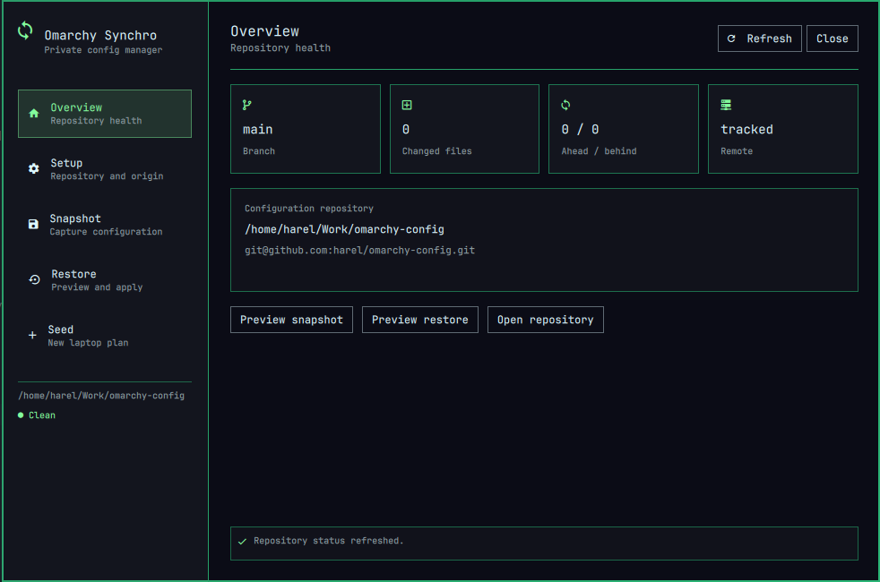

# Omarchy Synchro

Omarchy Synchro is a distributable Codex plugin, Omarchy Shell widget/native overlay, and standalone CLI. Reusable source stays in this repository; every user's private snapshot lives in a separately selected Git repository (private or public). You can use this to restore your system on a new machine and keep a backup of your configuration.



## Safety contract

- Explicit allowlist with mandatory secret-name/content, cache, browser, keyring, nested-Git, and plugin-tree exclusions.
- Portable and device-specific captures are separated.
- Snapshot and restore default to previews. Applying either requires `--apply`.
- Snapshot never stages, commits, or pushes; Git commit and push are separate, explicitly confirmed actions.
- SSH/HTTPS remotes use existing Git authentication; credential-bearing URLs are rejected.
- `/usr/share/omarchy` is never captured or modified.
- Third-party Omarchy plugins are captured as declarations (public origin, revision, enabled state, placement, and settings), never as working trees.

## First use

```bash
bin/omarchy-synchro config select ~/Work/omarchy-config
bin/omarchy-synchro repo init
bin/omarchy-synchro repo origin set git@github.com:you/omarchy-config.git
bin/omarchy-synchro repo origin test
bin/omarchy-synchro snapshot
bin/omarchy-synchro snapshot --apply
git -C ~/Work/omarchy-config diff
```

Edit `policy/allowlist.tsv` in the configuration repository to approve capture sources. Device-sensitive entries must use the `device` scope.

Restore is dry-run by default:

```bash
bin/omarchy-synchro restore
bin/omarchy-synchro restore --apply
```

Device data is excluded unless `--include-device` is explicitly supplied.

## Git operations

`repo origin show|set|test|remove` manages only `origin`. Synchro exposes ahead/behind and dirty state. `repo commit --message MESSAGE` stages only managed snapshot/policy paths, and `repo push` pushes committed history; both are separately confirmed in the overlay and neither runs as part of snapshot.

## New laptop seed

`bin/omarchy-synchro seed` reports the staged workflow. Package/plugin installation and component reload stages remain preview-only until separately approved and implemented.

## Local install and uninstall

Run `scripts/install-local` only after both plugin validators and tests pass. `scripts/uninstall-local` removes the Shell integration but preserves the selected configuration repository and `~/.config/omarchy/omarchy-synchro.json`.

## Native overlay

Click the Synchro top-bar widget to open the native dashboard:

- **Overview** summarizes branch, dirty files, ahead/behind counts, remote state, repository path, and origin.
- **Setup** selects or initializes the configuration repository and sets, replaces, displays, tests, or removes `origin`.
- **Snapshot** previews capture changes before a separately confirmed apply.
- **Restore** defaults to a portable-only dry run, with device files opt-in and apply separately confirmed.
- **Seed** presents the staged new-laptop workflow.

Snapshot manifests include `plugins.json` and `shell.json`. The plugin seed stage identifies installed, missing, and manual-source plugins without installing anything. Local filesystem origins are deliberately omitted and reported as manual steps.

Every Seed screen stage runs a real read-only diagnostic: base/schema compatibility, portable restore delta, missing native/AUR packages, plugin state, MIME-default comparison, required component reloads, or device/secret/manual-step reporting. A successful preview never implies that changes were applied.

## Tests

```bash
python -m unittest discover -s tests -v
omarchy plugin validate omarchy-shell/harel.omarchy-synchro
python /home/harel/.codex/skills/.system/plugin-creator/scripts/validate_plugin.py .
```
