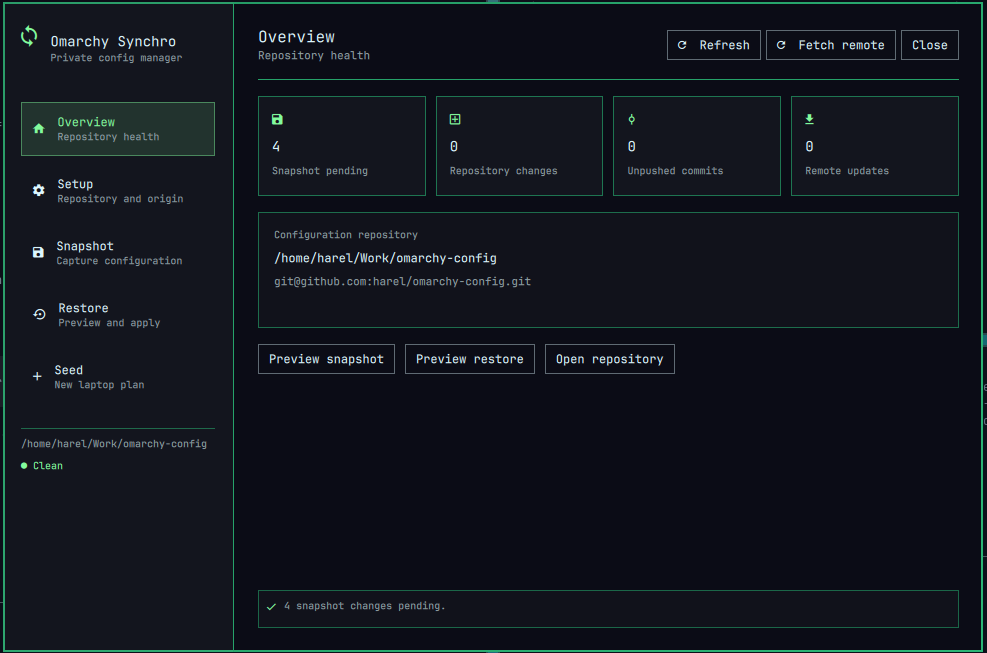

# Omarchy Synchro

Omarchy Synchro keeps a reviewable backup of your personal Omarchy setup in a separate Git repository. It combines an Omarchy top-bar widget and native dashboard with an optional command-line interface.

Your reusable Synchro plugin and your private configuration are always kept in different repositories.



## What it saves

Synchro captures an explicitly approved selection of configuration rather than copying your entire home directory. A snapshot can include:

- Portable application, terminal, Hyprland, MIME and Omarchy configuration.
- Device-specific monitor and input configuration, stored separately.
- Native and AUR package lists.
- Omarchy Shell layout and widget settings.
- Third-party Omarchy plugin declarations, including public source, revision, enabled state, placement and settings.

It does not copy installed plugin working trees. Private keys, credentials, tokens, browser profiles, cookies, keyrings, password stores, caches and other sensitive/generated state remain excluded.

## Install

Install the Omarchy Shell plugin directly from its Git repository:

```bash
omarchy plugin add https://github.com/harel/omarchy-synchro.git --enable
```

Omarchy displays its standard warning before cloning third-party code and asks where to place the bar widget. After installation, click the Synchro icon to complete setup in the dashboard.

To remove the Shell plugin later:

```bash
omarchy plugin remove harel.omarchy-synchro
```

Removing the plugin does not delete the separately selected configuration repository.

## New user guide

Once Synchro is installed, normal setup can be completed entirely from the dashboard—no terminal commands are required.

### 1. Open Synchro

Click the Synchro icon in the Omarchy top bar. The **Overview** screen summarizes the selected repository and whether configuration changes are waiting for review.

### 2. Choose where your private configuration will live

Open **Setup** and enter a separate folder for your configuration, for example:

```text
~/Work/omarchy-config
```

Click **Select**, then **Initialize**. Synchro creates a new Git repository with a safe starter allowlist. It never initializes or stores personal data inside the reusable plugin repository.

### 3. Connect an optional remote backup

Still in **Setup**, enter the SSH or HTTPS URL of your configuration repository and click **Set origin**. Use **Test access** to verify authentication.

A private remote repository is recommended because snapshots contain personal configuration, even though secrets are excluded. Synchro uses your existing Git/SSH authentication and never stores credentials.

### 4. Create the first snapshot

Open **Snapshot**. The preview distinguishes between:

- **Live configuration changes** that have not yet been copied into the snapshot.
- **Git repository changes** already captured but still waiting to be committed.

Click **Apply reviewed snapshot** only after checking the preview. Applying a snapshot updates files inside the configuration repository; it does not stage, commit or push them.

### 5. Commit and push separately

Enter a clear commit message and click **Commit snapshot**. Synchro stages only its managed snapshot and policy paths, then asks for confirmation.

Click **Push commits** separately if you want to upload committed history to the configured origin. Snapshot, commit and push are deliberately independent actions.

## Everyday use

1. Open **Snapshot** to see whether live configuration has changed.
2. Preview and apply the snapshot.
3. Review the Git changes shown by Synchro or open the repository in a terminal for a full diff.
4. Commit with a descriptive message.
5. Push when you are ready.

The **Overview** screen shows the current branch, dirty-file count, ahead/behind counts and remote state.

## Restoring configuration

Open **Restore** to compare saved configuration with the current laptop.

- Restore is a dry run by default.
- Portable files are selected by default.
- Device-specific monitor and input files require an explicit opt-in.
- **Apply reviewed restore** requires confirmation and backs up replaced files first.

Device-specific configuration should only be restored to the same or deliberately approved hardware.

## Moving to a new laptop

The current new-laptop workflow is deliberately staged:

1. Install a compatible base Omarchy system.
2. Install Omarchy Synchro.
3. Clone your existing private configuration repository, then select that folder in **Setup**.
4. Open **Seed** and run **Check**.
5. Review **Restore**, **Packages**, **Plugins**, **MIME**, **Reload** and **Report**.
6. Use the dedicated Restore screen to preview and apply portable configuration.

Repository cloning is the one bootstrap operation not yet available in the overlay. Until it is implemented, clone the repository once in a terminal:

```bash
git clone <your-private-config-repository> ~/Work/omarchy-config
```

The Seed buttons currently perform read-only diagnostics:

- **Check** verifies Omarchy, the selected repository and snapshot compatibility.
- **Restore** reports portable files that would change.
- **Packages** identifies missing native and AUR packages.
- **Plugins** reports installed, missing and manual-source Omarchy plugins.
- **MIME** compares saved application defaults.
- **Reload** identifies affected components.
- **Report** lists device-specific files, excluded secrets and manual steps.
- **Help** restores these explanations in the dashboard.

Package/plugin installation and component reload are not automatic yet. A successful Seed diagnostic means the check completed—it does not mean changes were applied.

## Safety model

- Capture is controlled by an explicit allowlist.
- Mandatory exclusions protect secret-name/content patterns, browsers, keyrings, password stores, caches, nested Git repositories and installed plugin trees.
- Portable and device-specific data are separated.
- Snapshot and restore are preview-first.
- Snapshot, commit and push are independent and separately confirmed.
- Credential-bearing remote URLs are rejected.
- `/usr/share/omarchy` is read-only and never captured or modified.
- The plugin refuses configuration repositories that overlap its own source or installed plugin paths.

The personal allowlist lives at `policy/allowlist.tsv` inside the selected configuration repository. Advanced users can edit it to approve additional home-relative paths. Hardware-sensitive paths must use the `device` scope.

## Command line — optional

The CLI provides the same core workflows for advanced users and automation. It is not required for ordinary first-time setup.

```bash
# Select and initialize a separate configuration repository
bin/omarchy-synchro config select ~/Work/omarchy-config
bin/omarchy-synchro repo init

# Configure and test origin
bin/omarchy-synchro repo origin set git@github.com:you/omarchy-config.git
bin/omarchy-synchro repo origin test

# Preview, then apply a snapshot
bin/omarchy-synchro snapshot
bin/omarchy-synchro snapshot --apply

# Commit and push explicitly
bin/omarchy-synchro repo commit --message "Update Omarchy configuration"
bin/omarchy-synchro repo push

# Preview, then apply portable restoration
bin/omarchy-synchro restore
bin/omarchy-synchro restore --apply

# Inspect an individual Seed stage
bin/omarchy-synchro seed --stage plugins
```

Add `--include-device` to restore only when device-specific configuration has been deliberately reviewed.

## Local development install and uninstall

Validate before installing a local development checkout:

```bash
python -m unittest discover -s tests -v
omarchy plugin validate .
python /home/harel/.codex/skills/.system/plugin-creator/scripts/validate_plugin.py .
scripts/install-local
```

`scripts/uninstall-local` removes the Shell integration. It does not delete the selected configuration repository or its history.
